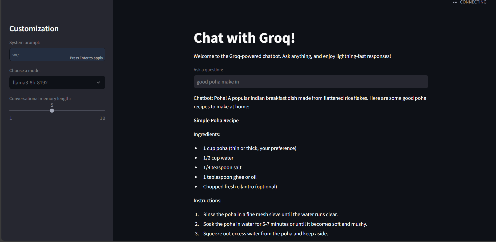

# Groq Chatbot Application

## Overview

The Groq Chatbot Application is a Streamlit-based interface that allows users to interact with a Groq-powered conversational AI. This application utilizes LangChain to handle conversational memory and provide context-aware responses to user queries.

## Features

- **Conversational Memory**: Remembers previous interactions to maintain context.
- **Customizable Settings**: Users can set a system prompt and select from various models.
- **User-Friendly Interface**: Built using Streamlit for easy interaction.

## Requirements

Before running the application, ensure you have the following installed:

- Python 3.11 or higher
- Streamlit
- LangChain
- Groq

## Getting Started

1. **Clone the Repository**: 

   Clone this repository to your local machine using:

   ```bash
   git clone https://github.com/yourusername/groq-chatbot.git
   cd groq-chatbot
   ```
You can install the necessary packages using pip:

```bash
pip install -r requirement.txt
```

2. **Set Up Environment Variables**: 

   Create a `.env` file in the root of your project and add your Groq API key:

   ```
   GROQ=your_groq_api_key_here
   ```

3. **Run the Application**:

   Use the following command to start the Streamlit app:

   ```bash
   streamlit run App.py
   ```

4. **Access the Application**:

   Open your web browser and go to `http://localhost:8501` to interact with the chatbot.

## Usage

- Enter a question in the provided input box.
- Customize the system prompt and select your desired model from the sidebar.
- The chatbot will respond with context-aware answers based on your queries and previous interactions.

## Contributing

Contributions are welcome! If you would like to contribute to this project, please follow these steps:

1. Fork the repository.
2. Create a new branch (`git checkout -b feature/YourFeature`).
3. Make your changes and commit them (`git commit -m 'Add your feature'`).
4. Push to the branch (`git push origin feature/YourFeature`).
5. Create a pull request.

## License

This project is licensed under the MIT License - see the [LICENSE](LICENSE) file for details.

## Acknowledgements

- [Streamlit](https://streamlit.io/)
- [LangChain](https://www.langchain.com/)
- [Groq](https://www.groq.com/)

## Sample Image

Below is a sample image illustrating the chatbot interface:

